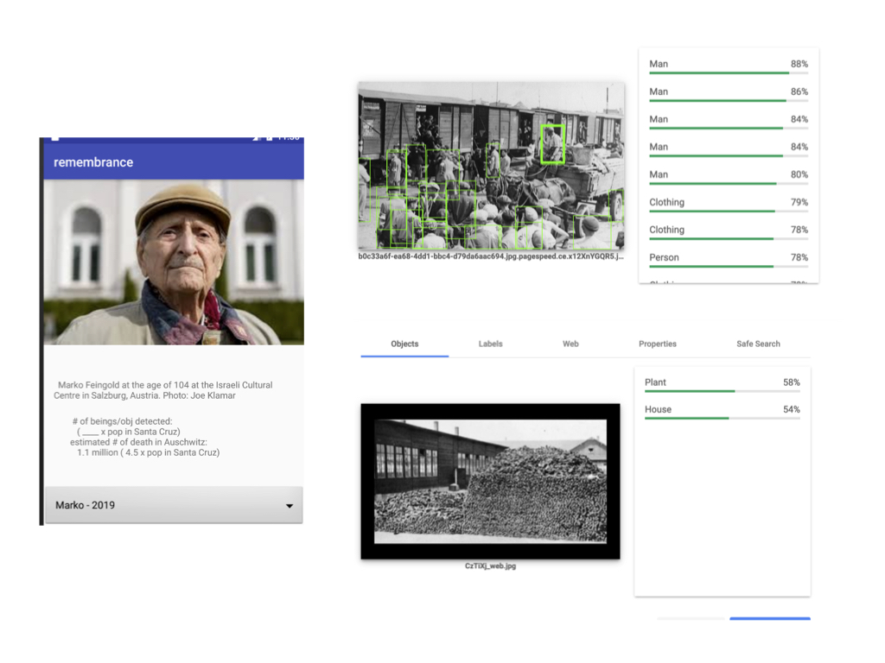

# remembrance-1945

This [hackthaon project](https://devpost.com/software/remembrance-1945) is dedicated to the memory of those whose tragic lives and inhumanity are being stripped and lost in holocaust.
It is important for us to learn about the history and the danger of authoritarian government.

This project also highlights how ML technology can easily manipulate our recollection of the past and current events in both ways. 

### Description
My demo app proposes the use of imaging processing ML API/library to provide a more relateable context to the historical images.

 

 
